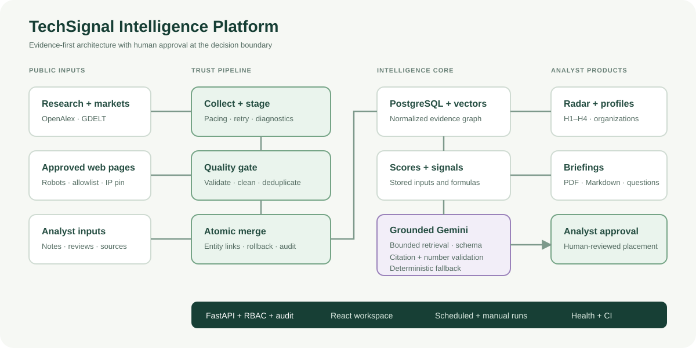
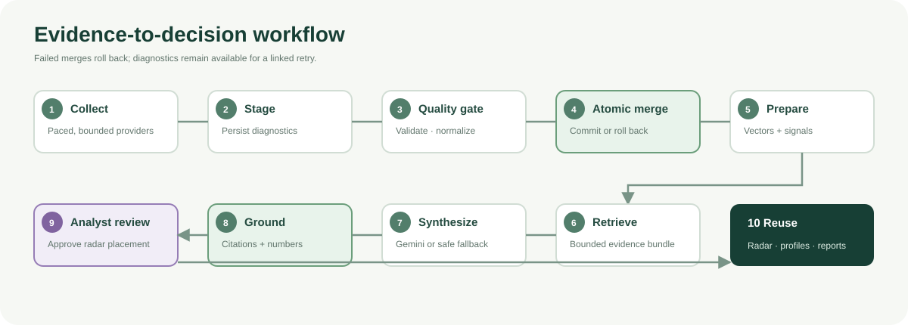
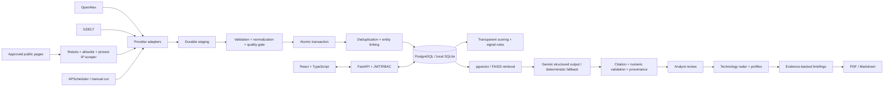

# Grid Technology Intelligence Radar

An evidence-first portfolio platform for scouting emerging grid technologies.
It connects research, organizations and market signals to transparent scores,
analyst-reviewed horizons, an interactive radar and decision-ready briefings.

**Portfolio horizon methodology — not Siemens Energy internal methodology.**
The configurable H1–H4 definitions are illustrative portfolio rules. This project
neither reproduces nor claims knowledge of Siemens Energy's internal PRM radar.
All bundled startup, institutional, research and news records are visibly
**synthetic sample data**, not real current market intelligence.

## Quick start

### Docker / PostgreSQL

Requires Docker Engine/Desktop with Compose v2:

```bash
docker compose up --build
```

Open [the application](http://localhost:8080) and [Swagger API documentation](http://localhost:8000/docs).
Compose starts PostgreSQL 16 with pgvector, runs Alembic migrations and loads the
idempotent demo seed. No API keys are required. Containers bind host ports to
loopback only; do not expose published demo credentials on the public internet.
The backend starts with one worker because local jobs are in-process.

### Local Python + Node (no Docker)

Requires Python 3.11+ (tested 3.12) and Node 22+:

```bash
python3.12 -m venv .venv
.venv/bin/pip install -r backend/requirements.txt
cd backend
../.venv/bin/alembic upgrade head
../.venv/bin/uvicorn app.main:app --reload --host 127.0.0.1 --port 8000
```

In a second terminal, from the repository root:

```bash
cd frontend
npm ci
npm run dev -- --host 127.0.0.1
```

Open [the local frontend](http://127.0.0.1:5173). Without DATABASE_URL, the backend
uses `backend/radar.db` (SQLite). This makes the demo runnable with no database
service. PostgreSQL remains the production/deployment target. `scripts/dev.sh`
combines installation, migration and both servers for subsequent local runs.

Do not copy the Docker DATABASE_URL unchanged into a non-Docker local `.env`.
For local PostgreSQL use your actual host/credentials. Configuration reads the
repository-root `.env` when the backend is launched from `backend/`.

| Demo role | Email | Password |
|---|---|---|
| Admin | `admin@radar.local` | `RadarDemo2026!` |
| Analyst | `analyst@radar.local` | `RadarDemo2026!` |
| Viewer | `viewer@radar.local` | `RadarDemo2026!` |

These credentials apply only to seeded development databases. Production startup
rejects demo mode, demo seeding and the default application secret.

## Why it exists / portfolio context

A technology analyst needs to answer what is changing, which organizations are
involved, how strong the evidence is, and what to investigate next. A chatbot
alone cannot maintain the structured relationships or decision history needed
for that work. Grid Radar demonstrates research intelligence, data engineering,
AI grounding, explainable assessment and analyst decision support in one system.

### Fit for technology scouting work

The application represents the outcomes of a grid-technology scouting role:
monitoring selected domains, maintaining structured H1–H4 records, tracking
startups and research institutions, preparing background notes and briefings, and
using AI to improve search and synthesis. It demonstrates those capabilities
through working software rather than mirroring a job description or claiming an
employer's internal process. See the [role-alignment matrix](docs/role-alignment.md)
for the evidence behind each capability and the boundaries of the portfolio claim.

## Features

- Executive dashboard, active signal feed and review queue.
- Fifteen seeded technologies across eleven configurable domains; create, edit,
  archive and query-keyword management.
- Plotly radar with H1–H4 rings, hover/click details, domain/search/maturity/
  confidence/signal filters and placement history.
- Profiles with evidence, source distribution, research/news trends, citation
  snapshots, organizations, analyst notes, assessment history and related items.
- Startup creation/editing and institution profiles ranked by collected factual
  publication counts; missing partnerships or patents are never invented.
- OpenAlex and GDELT adapters; optional Semantic Scholar enrichment boundary;
  EPO OPS adapter explicitly reserved for a later release.
- Allowlisted, robots-aware, IP-pinned public-page scraping with bounded fragments.
- Staging, quality gates, transactional merge, idempotent deduplication, run logs
  and safe retry of failed pipeline runs.
- Configurable score weights and signal thresholds; every score persists its
  inputs, weights, formula and calculation timestamp.
- Gemini structured JSON, bounded retrieval, validated evidence IDs, AI provenance
  and explicit analyst approval. No-key mode returns labelled deterministic output.
- Local vector retrieval using FAISS, optional PostgreSQL pgvector; optional
  pretrained sentence-transformer encoder for semantic similarity.
- Weekly/monthly portfolio reports, technology opportunity reports and organization
  briefings with Markdown and PDF exports.
- JWT/Argon2 local authentication with server-side Admin/Analyst/Viewer enforcement,
  audit history, configurable CORS and expensive-endpoint rate limits.
- Optional APScheduler jobs, Docker images, GitHub Actions and Azure preparation.

## Architecture



The diagram separates public/synthetic inputs, the transactional trust pipeline,
the intelligence core and the analyst decision boundary. Generated text cannot
move a radar placement; only an authenticated analyst review can do that.

## Workflow



Successful runs complete every displayed stage. If collection or validation fails,
the production merge does not occur. If a failure happens during the merge, the
transaction rolls back while the run and step diagnostics remain available for a
linked retry. Gemini failures and unsupported citations or numbers fall back to a
deterministic evidence summary rather than breaking the analyst workflow.

### Machine-readable architecture



### Repository

```text
backend/
  app/{api,models,schemas,services,repositories,providers,pipelines,
       ai,scrapers,analytics,tasks,utils,tests}/
  alembic/versions/
frontend/src/{components,pages}/
data/startups.csv
docs/{implementation-plan,security-and-methodology,role-alignment,azure-deployment}.md
docs/images/{system-architecture,intelligence-workflow}.svg
scripts/{dev.sh,postgres_smoke.py}
.github/workflows/ci.yml
```

### Stack

React 19, TypeScript, Vite, Plotly, Lucide; Python 3.12, FastAPI, Pydantic,
SQLAlchemy 2, Alembic; PostgreSQL 16/pgvector; FAISS/NumPy; requests/BeautifulSoup;
APScheduler; ReportLab; pytest, Vitest and Testing Library.

## Data sources and real ingestion

Adapter details are based on the [OpenAlex API documentation](https://help.openalex.org/api/),
[GDELT DOC API](https://blog.gdeltproject.org/gdelt-doc-2-0-api-debuts/), and
[Gemini structured-output documentation](https://ai.google.dev/gemini-api/docs/structured-output).
OpenAlex provides titles, inverted-index abstracts, DOI, authors, institutions,
citation totals, journal and topics. GDELT stores metadata only; its first-seen
value is labelled as such rather than falsely asserted as a publication date.

Set `DEMO_MODE=false` to view/operate on real evidence. The sample evidence remains
isolated. For clean production use an empty database, `SEED_DEMO=false`, and
`python -m app.cli bootstrap-admin`; create real technology definitions in the UI.
For exploration, the seeded technology names/keywords can serve as query templates,
but their synthetic baseline assessments remain labelled and need real review.

From `backend/` with the virtual environment active:

```bash
python -m app.cli ingest-openalex --technology "Grid-forming converters" --limit 10
python -m app.cli ingest-gdelt --technology "Grid-forming converters" --limit 10
python -m app.cli refresh-web-sources --limit 10
python -m app.cli calculate-signals
python -m app.cli generate-embeddings
python -m app.cli analyze-technologies --technology "Grid-forming converters"
```

OpenAlex/Gemini keys activate their configured adapters without code changes.
External requests can fail due to quotas, API changes or access restrictions;
failed runs remain inspectable and preserve the last committed state. The optional
Semantic Scholar provider exposes `enrich(doi)` with a feature flag. EPO raises an
explicit not-implemented error rather than returning fictitious patent data.

Web sources are added through Admin settings after configuring an exact domain
allowlist. Scraping is disabled by default. Only publicly permitted, unauthenticated
pages are appropriate. Redirects fail closed. See the [scraper and trust model](docs/security-and-methodology.md).

## AI architecture and evidence grounding

`LLMProvider` is the replacement boundary. Gemini uses the REST generateContent
API with a Pydantic-generated JSON schema. Relevant records are retrieved into a
bounded context (8 results from at most 2,000 recent candidates). Returned IDs are
validated against exactly those records. Numeric claims are rejected unless the
same number occurs in supplied evidence or verified metrics. Model-generated
confidence and horizon values are replaced with deterministic application rules.
Analyses record model, prompt version,
timestamp, output, token usage, confidence, actor and approval status. External
text is designated untrusted data in the system instruction.

No-key mode is deterministic and clearly labelled; it does not pretend Gemini
ran. The default local encoder hashes word and bigram features into normalized
384-dimensional vectors. This is a cheap, offline **lexical** fallback, not a
pretrained semantic model. For semantic retrieval:

```bash
pip install -r requirements-semantic.txt
# Set EMBEDDING_BACKEND=sentence-transformers in .env, then restart and run:
python -m app.cli generate-embeddings
```

The configured default optional model is `sentence-transformers/all-MiniLM-L6-v2`.
Its first use downloads model weights and requires network access. Encoder changes
trigger regeneration; use a 384-dimensional model. pgvector is installed under a
migration savepoint when supported; otherwise FAISS is used, with NumPy as a final
non-index fallback. The index is scoped to filtered evidence, never the entire
LLM context. Citation membership and numeric support are checked; claim entailment
still needs review. Provider timeouts, malformed JSON, unsupported citations and
unsupported numbers produce a labelled deterministic fallback.

## Radar methodology / scoring

| Horizon | Default portfolio meaning | Illustrative years | Maturity floor |
|---|---|---|---|
| H1 | Near-term / relatively mature | 0–2 | 80 |
| H2 | Emerging / increasing practical activity | 2–5 | 55 |
| H3 | Longer-term / promising but uncertain | 5–10 | 30 |
| H4 | Exploratory / early research | 10+ | 0 |

Admin-editable names, descriptions, year labels, thresholds, rule metadata and
order. Score rules use the explicit `min_maturity` field; freeform rule metadata
is explanatory, not executable code. AI suggestions never overwrite approved
placements. Only the review endpoint records a new analyst assessment and radar
history. Scores normalize to 0–100; formulas are shown in each profile. Defaults:
research .30, commercial .25, maturity .20, relevance .15, evidence .10.
Growth with a zero baseline and missing citation history are explicitly flagged.

## Database design

UUID records, timestamps, indexed foreign keys and unique source/DOI/URL identities.
Core tables: users/roles; technologies/domains/keywords; evidence plus many-to-many
technology links; papers/authors/institutions and join tables; news/patents;
organizations/startups; sources; assessments/radar history; scores/signals;
AI analyses/reports/briefings; runs/steps/staging; settings/audit logs/jobs.
PostgreSQL optionally adds `evidence_vectors`. Migrations are checked in as explicit
DDL. `alembic upgrade head` creates the schema; seed is idempotent on a fresh/demo DB.
All production changes from a run share a transaction; diagnostic staging survives
failure. Retries create a linked new run and safely replay its bounded work.

## Configuration

See [.env.example](.env.example). Main settings:

| Variable | Purpose |
|---|---|
| DATABASE_URL | SQLAlchemy PostgreSQL URL; unset uses local SQLite |
| APP_SECRET | JWT signing secret, unique ≥32 chars in production |
| ENVIRONMENT | development / production |
| DEMO_MODE / SEED_DEMO | Query synthetic records / initialize demo records |
| GEMINI_API_KEY / GEMINI_MODEL | Gemini credentials and model ID |
| OPENALEX_API_KEY | Optional/configuration-dependent OpenAlex authentication |
| SEMANTIC_SCHOLAR_API_KEY | Optional enrichment authentication |
| EPO_CONSUMER_KEY / EPO_CONSUMER_SECRET | Reserved future integration |
| ENABLE_GDELT / ENABLE_SEMANTIC_SCHOLAR / ENABLE_EPO | Provider feature flags |
| ENABLE_WEB_SCRAPING | Explicitly enable approved source collection |
| SCRAPER_ALLOWED_DOMAINS | JSON array of exact public hostnames |
| SCRAPER_USER_AGENT | Identifying user-agent; configure real contact information |
| ENABLE_SCHEDULER | Enable daily ingestion/maintenance and weekly reports |
| CORS_ORIGINS | JSON array of allowed browser origins |
| EMBEDDING_BACKEND / EMBEDDING_MODEL | Offline lexical or optional semantic encoder |

Never commit `.env` or real credentials. Secrets are never returned by `/settings`.

## API documentation

FastAPI exposes [OpenAPI/Swagger](http://localhost:8000/docs). Application endpoints
are under `/api` (login `/api/auth/login`; bearer JWT required elsewhere):

- `/technologies`, `/technologies/{id}`, `/technologies/{id}/review`, `/radar`
- `/signals`, `/papers`, `/evidence`, `/startups`, `/institutions`, `/organizations/{id}`
- `/pipeline/run`, `/pipeline/runs`, `/pipeline/runs/{id}`, `/pipeline/runs/{id}/retry`
- `/ai/technology-analysis`, `/ai/query`
- `/briefings/startup`, `/briefings/institution`, `/briefings/technology`
- `/reports`, `/reports/generate`, `/reports/{id}/export?format=pdf|md`
- `/settings`, `/settings/horizons/{id}`, `/settings/weights`, `/settings/signal-rules`
- `/sources`, `/users`, `/quality`, `/audit`

Health endpoints `/health` and `/health/ready` do not require authentication.

## Testing and verification

```bash
cd backend
../.venv/bin/ruff check app
../.venv/bin/pytest -q
../.venv/bin/alembic check
cd ../frontend
npm run lint
npm test
npm run build
```

Tests use provider fixtures and no external API calls. Coverage includes seed
counts, normalization, deduplication/upserts, horizon logic, mode isolation,
retrieval bounds, AI JSON/citations, rollback, invalid staging, login/RBAC,
review citation ownership and PDF/Markdown exports. UI tests check source labels,
primary-source links, search input and modal interactions.

GitHub Actions additionally starts PostgreSQL/pgvector, runs migration and rollback
smoke checks, builds Docker images and starts the complete Compose application.
The local verification record is in [the implementation plan](docs/implementation-plan.md).
The detailed success, failure and grounding cases are in the
[verification matrix](docs/verification-matrix.md).
Local PostgreSQL 16 + pgvector migration, rollback, merge and retrieval checks passed.
Live Gemini generation and OpenAlex collection were also exercised. Docker is not
installed on the development host; Compose execution remains a CI/deployment check.
GDELT currently returns provider rate-limit errors.

## Scheduling / deployment

`ENABLE_SCHEDULER=true` enables UTC daily collection, embedding/signal maintenance,
weekly AI reassessment and Monday reports. In demo mode collection stays synthetic.
Manual admin runs execute as background tasks. Interrupted runs are marked failed
on restart. Use one worker/replica; move to Celery/Redis and a dedicated scheduler
before scaling. See [Azure Container Apps preparation](docs/azure-deployment.md).

## Roadmap and honest boundaries

- Distributed durable job queue and shared rate limiting.
- Licensed EPO OPS ingestion and genuine longitudinal citation/patent signals.
- Controlled Playwright rendering for explicitly approved JS-only sources.
- Broader semantic relevance evaluation, sentence-level claim checks and analyst
  calibration of maturity/confidence/strategic relevance.
- Snapshot-based institution/startup/citation activity; automated link-rot review.
- Source coverage benchmarking, stronger production observability and load tests.

This is runnable portfolio software with a production-style architecture, not a
claim of a fully hardened enterprise deployment or validated market intelligence.

## Microsoft single sign-on

Microsoft Entra SSO is implemented alongside local accounts. See [SSO setup](docs/sso-setup.md)
for tenant registration, redirect URLs and role mapping. The button stays disabled
until credentials are configured. The sidebar scrolls independently, with a pinned
Sign out button and a header shortcut on small screens.
